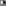
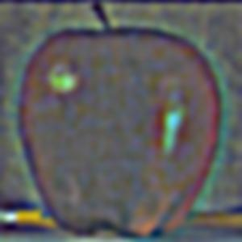

Programming Project #2 (proj2)

Fun with Filters and Frequencies!

## Part 1: Fun with Filters

## Part 1.1: Finite Difference Operator

We start by generating edges for the cameraman picture using gradient magnitude computation. The way it works is by first generating the the horizontal derivative of the image, followed by the vertical derivative of the image, and then by taking the square root of the sum of squares of both deritvatives, just like how you compute the pythagorean theorem. This way, the negative values in each derivative image will turn into positives and you will be left with an image where edges are all colored white.

| Dx | Dy |
|  |  |
Dx: 

Dy: 

Gradient magnitude: 

Then, we binarize the gradient magnitude in order to remove a lot of the noise within the image:

## Part 1.2: Derivative of Gaussian (DoG) Filter

First, we try to blur the image before doing what we did in the last part. The results are as follows:

Original:  

Blured:  

Edge gradient magnitude: 

Binarized: 

Then, instead of applying a gaussian blur and then the derivatives as two convolutional operations, we convolve the gaussian by the derivatives so that the whole operation is done in one convolution on the image.

Derivative of gaussian Dx:  

Derivative of gaussian Dy: 

Dx result: 

Dy result:  

Gradient magnitude: 

Binarized: 

## Part 2: Fun with Frequencies!

## Part 2.1: Image "Sharpening"

We use un-sharp masking in order to sharpen the following images.

### Sharpen Taj Mahal
 

### Sharpen Dog
 

### Blur image, then sharpen

I tried to blur a sharp image, then sharpen it back to see what happens. The result is a little blurrier and has fewer high frequencies than the original image.

  
 
## Part 2.2: Hybrid Images

In this part, I layer two images on top of each other so that in distance it appears as one, and close up it appears as the other. The images are first aligned so they match each other's geometries. For the first image, the lower frequencies are use and they are grayscaled. For the second image, the higher frequencies are used with their color.

### Derek and Nutmeg

 

 

The fourier results of the images are shown below:

Derek FFT:  

Derek Blur (low frequencies) FFT:  

Nutmeg FFT: 

Nutmeg high frequencies FFT: 

Combination Derek + Nutmeg FFTs: 

### Airplane and Eagle (Failure)

Because the eagle has a much larger and much darker wing than the plane, it isn't as smooth as the other results. It's obvious that two images are layer on each other. Other than that, the tips look good.

 

 

### John DeNero and Josh Hug

This is my favorite.

 

 

## Multi-resolution Blending and the Oraple journey

## Part 2.3: Gaussian and Laplacian Stacks

Here, we try to blend an apple and orange together. We use basic alpha blending where the images start smoothly reducing in alpha in the middle, so that they can be added on top of each other and appear as if they go into each other.

 

The following is the stack the closely resembles the figure in the original paper. Rows 1, 2, and 3 show the 0th, 2nd, and 4th laplacians of the apple, orange, and the apple-orange blend. The last row is just the original images alpha blended.

  

  

  

  

## Part 2.4: Multiresolution Blending (a.k.a. the oraple!)

To improve on the blending, we settle on a better algorithm that combines each level of the laplacians in the stacks and adds it on top of the lowest gaussian blur. This results in smooth blends between images that appear real. The algorithm is taken from the original paper.

### The Oraple

 

 

 

 

 

 

 

 

 

 

 

 

 

 

 

 

### Sun in a Sunflower

 

### Brain in a walnut (favorite)

 

 

 

 

 

 

 

 

 

 

 

 

 

 

 

 

 

 

 

Scoring
-->
The first part of the assignment is worth 30 points. The following things need to be answered in the html webpage along with the visualizations mentioned in the problem statement. The distribution is as follows:

(15 points) Include a brief description of gradient magnitude computation.
(15 points) Answer the questions asked in part 1.2
The second part of the assignment is worth 65 points, as follows:

20 points for the implementation of all four parts of the project.
The following are the points for the project html page description as well as results:
15 points for the Unsharp Masking: Show the progression of the original image to the sharpened image for the given image and an image of your choice.
5 points for hybrid images and the Fourier analysis;
5 points for including at least two hybrid image examples beyond the first (including at least one failure);
15 points for multiresolution blending;
5 points for including at least two multiresolution blending examples beyond the apple+orange, one of them with an irregular mask.
5 points for clarity.

For this project, you can also earn up to 10 extra points for the bells & whistles mentioned above or suggest your own extensions (check with prof first).
Tell us about the most important thing you learned from this project!